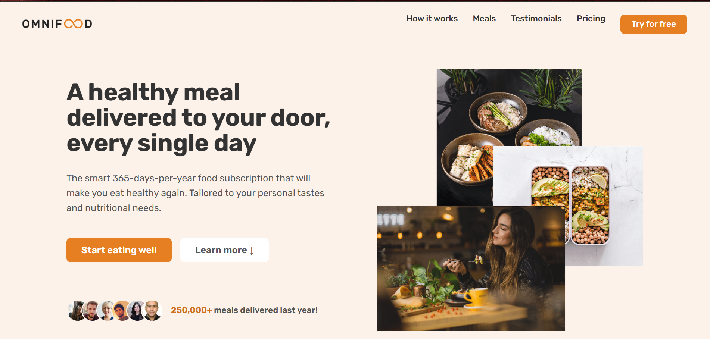
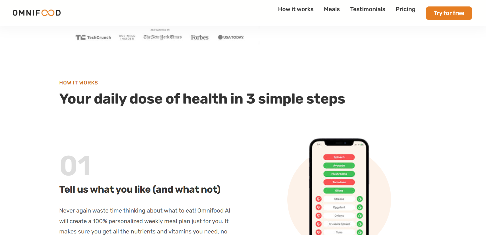
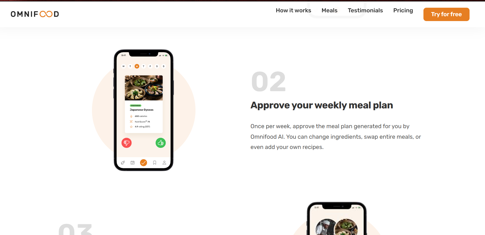
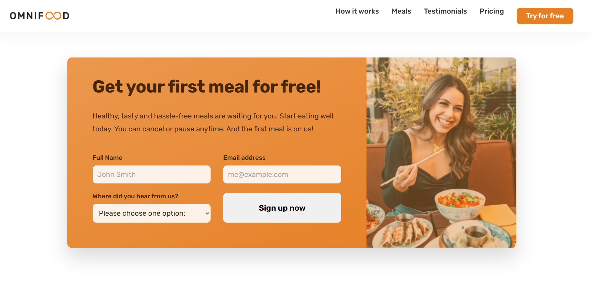
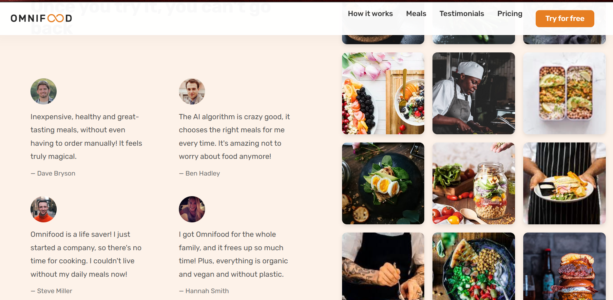

# 🍽️ Omnifood Website Clone

This is a fully responsive **Omnifood website clone**, created as part of my Web Development assignment.  
It is built using **HTML, CSS, and JavaScript**, and replicates the layout, design, and components of the original Omnifood landing page.

---

## 🚀 Features

- Fully responsive modern landing page  
- Smooth scrolling navigation  
- Sticky navigation bar  
- Healthy meals showcase section  
- Pricing plans & subscription section  
- Testimonials & gallery  
- CTA section  
- Clean & modern UI  
- Organized folder structure

---

## 🛠️ Technologies Used
- **HTML5**  
- **CSS3 (Flexbox, Grid, Animation)**  
- **JavaScript (Basic interactivity)**  
- **Google Fonts**  
- **Ionicons for icons**

---

## 📂 Project Structure## Screenshots

### Screenshot 1

### Screenshot 2

### Screenshot 3

### Screenshot 4

### Screenshot 5

